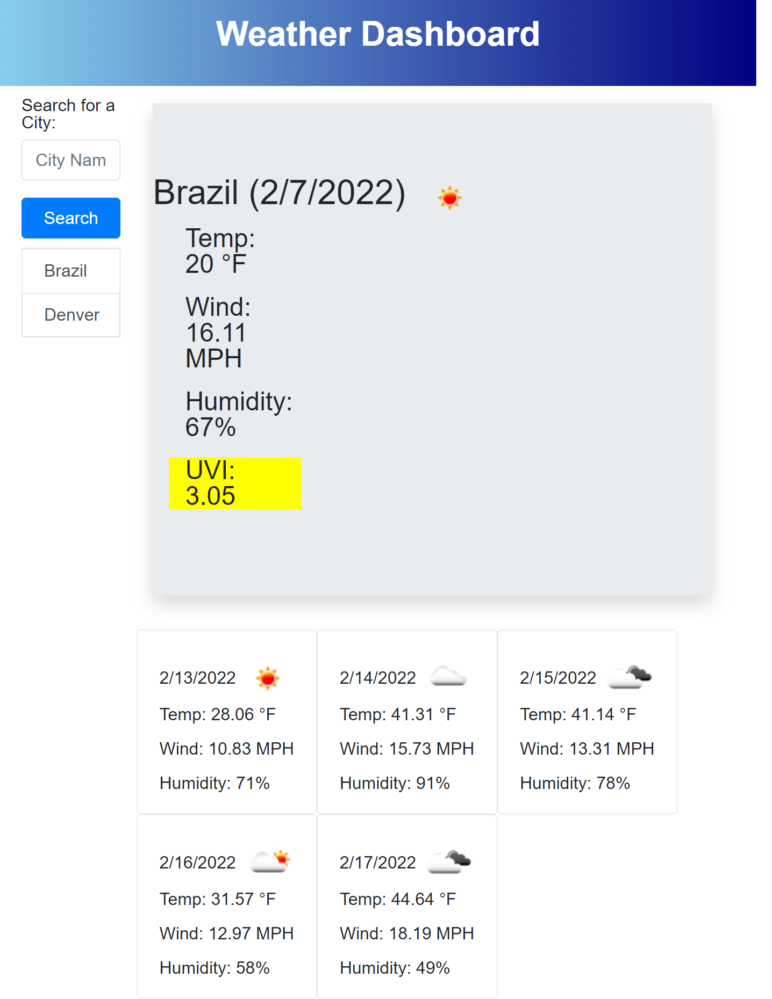

# Weather-app-week6
DU week 6 project, making a weather app

# Description
Make a weather tracking app, that pulls data from https://openweathermap.org/ to show current weather data of a searched for city. After showing the current data, the app should pull up the forecasted weather for the next five days. Each searched for city should be saved to local storage and pulled up as a list upon page load.

# Screenshot
Can be found at: https://skerans.github.io/Weather-app-week6/ 

# Built With

<ul>
  
HTML

  
CSS

  
JQuery

  
Openweathermap api

  
moment.js

</ul>
